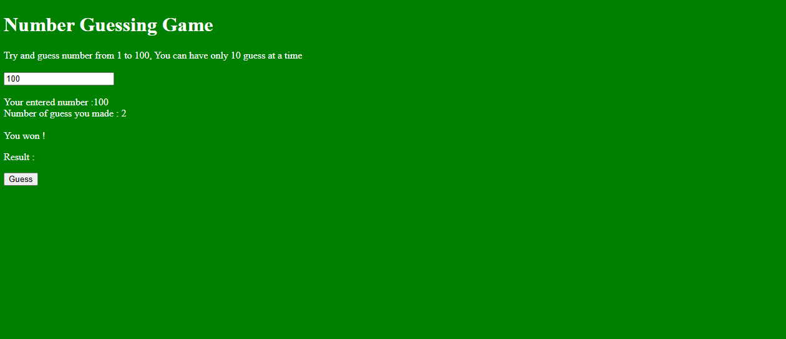
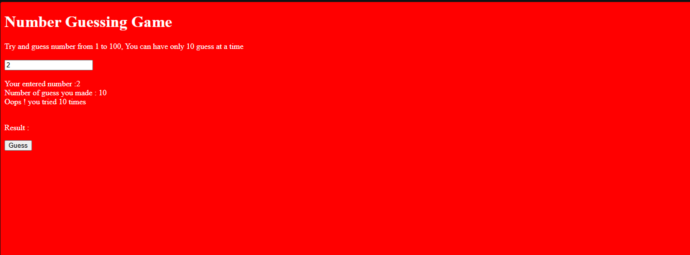

# 🎯 Number Guessing Game

A simple Number Guessing Game made using HTML, CSS, and JavaScript.

In this game, the computer generates a random number between **1 and 100**. The user has **10 chances** to guess the correct number.

## 🚀 Features

- Generates a random number automatically
- User can guess numbers between 1 to 100
- Maximum 10 attempts allowed
- Displays the number entered by the user
- Shows total guesses made
- Displays winning message when the correct number is guessed
- Changes background color:
  - Green when user wins
  - Red when attempts are finished

## 🛠️ Technologies Used

- HTML
- CSS
- JavaScript

## 📸 Screenshots

### Starting Screen


### Guess Attempt


### Winning Screen



### Game Over Screen



## 📂 Project Structure

```
guessnumber
│
├── index.html
├── style.css
├── main.js
└── README.md
```

## ▶️ How to Run This Project

1. Clone this repository:

```bash
git clone git@github.com:prashantsapk/guessnumber.git
```

2. Open the project folder:

```bash
cd guessnumber
```

3. Open `index.html` in your browser.

## 🎮 How to Play

1. Enter a number from 1 to 100.
2. Click the **Guess** button.
3. Try to find the correct number within 10 attempts.

## 👨‍💻 Author

**Prashant Sapkota**

GitHub:  
https://github.com/prashantsapk